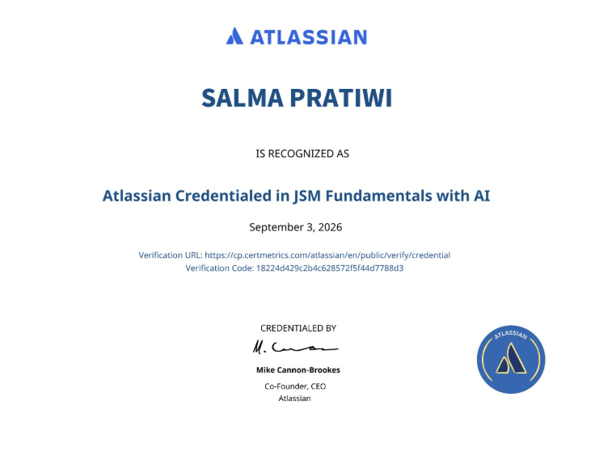
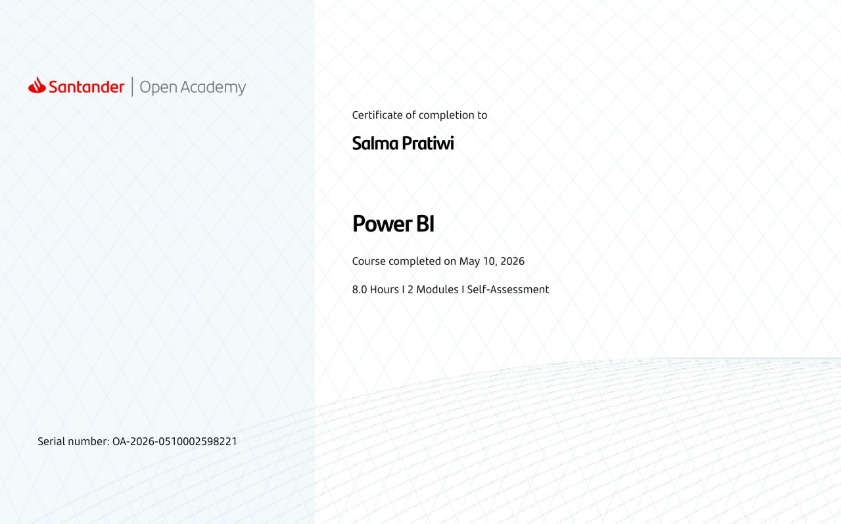
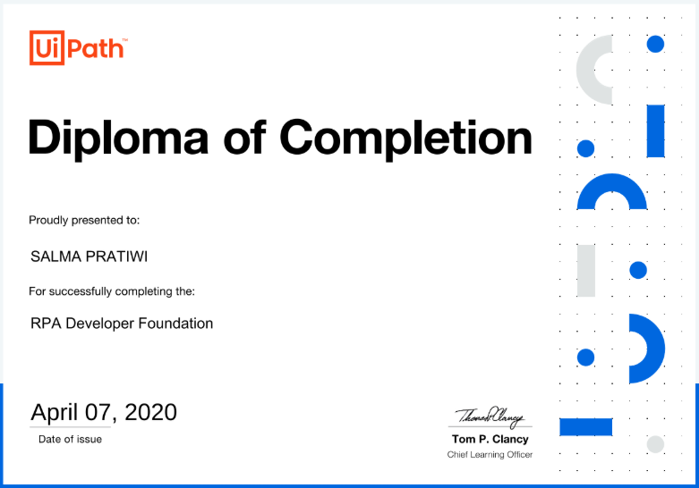
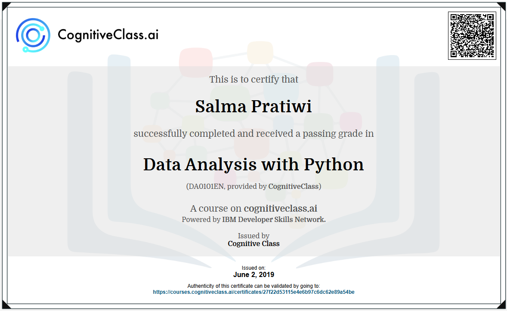
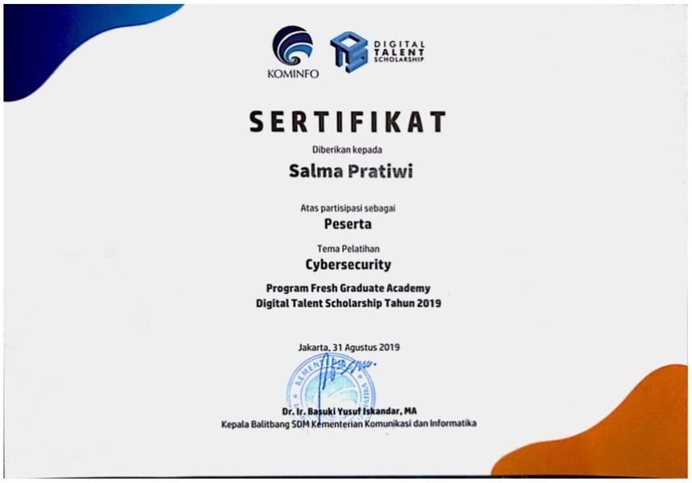

# Certifications

## Jira Service Management with AI Fundamentals
Issued by Atlassian   <small>(September 2026 - September 2027)</small>

???+ info "Show Credential"
    <figure markdown="span">
        { width="700" }
        <figcaption>
        Jira Service Management with AI Fundamentals Certificate 
        [Credential link](https://cp.certmetrics.com/atlassian/en/public/verify/credential/18224d429c2b4c628572f5f44d7788d3)
        </figcaption>
    </figure>

## Control-M 20.x for Automation API Developers Online Exam
Issued by BMC Software  <small>(February 2024 - February 2026)</small>

???+ info "Show Credential"
    <figure markdown="span">
        { width="700" }
        <figcaption>
        Control-M Automation API Developer Certificate
        </figcaption>
    </figure>

## Control-M 21.x for Schedulers Online Exam
Issued by BMC Software  <small>(May 2025 - May 2027)</small>

???+ info "Show Credential"
    <figure markdown="span">
        { width="700" }
        <figcaption>
        Control-M Scheduler Certificate
        </figcaption>
    </figure>

## Analyzing and Visualizing Data with Microsoft Power BI
Issued by Santander Open Academy  <small>(May 2026)</small>

???+ info "Show Credential"
    <figure markdown="span">
        { width="700" }
        <figcaption>
        Power BI Certificate
        </figcaption>
    </figure>

## RPA Developer Foundation
Issued by UiPath  <small>(April 2020)</small>

???+ info "Show Credential"
    <figure markdown="span">
        { width="700" }
        <figcaption>
        RPA Developer Foundation Certificate
        </figcaption>
    </figure>

## IBM Certified Specialist - Cognos TM1 10.1 Data Analysis
Issued by Cognitive Class  <small>(June 2019)</small>

???+ info "Show Credential"
    <figure markdown="span">
        { width="700" }
        <figcaption>
        Data Analysis with Python Certificate 
        [Credential link](https://courses.cognitiveclass.ai/certificates/27f22d53115e4e6b97c6dc62e89a54be)
        </figcaption>
    </figure>

## Cybersecurity Digital Talent Scholarship
Issued by Kominfo  <small>(August 2019)</small>

???+ info "Show Credential"
    <figure markdown="span">
        { width="700" }
        <figcaption>
        Cybersecurity Digital Talent Certificate
        </figcaption>
    </figure>
